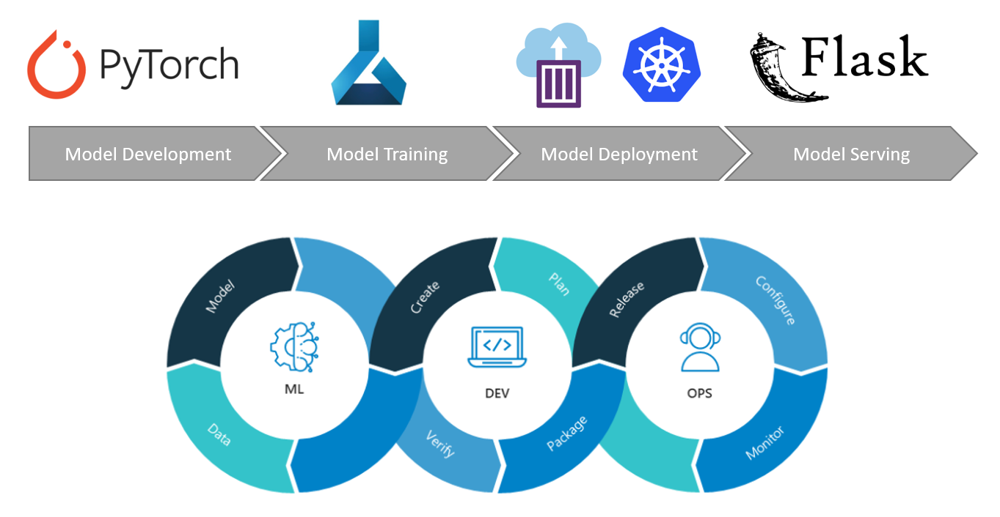
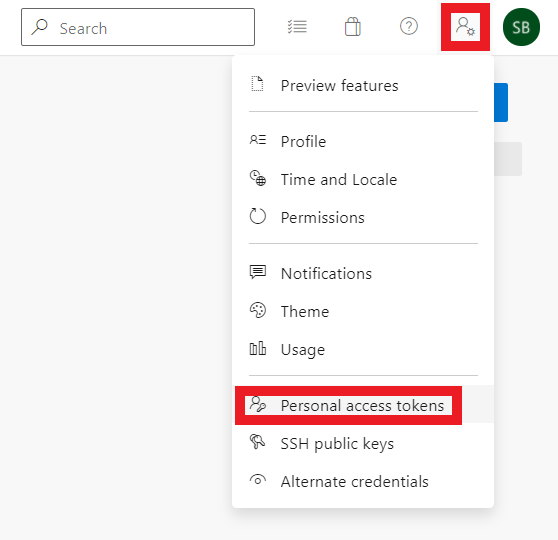
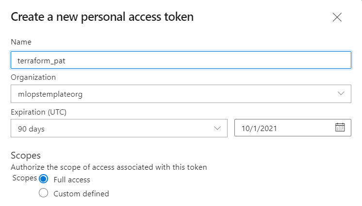
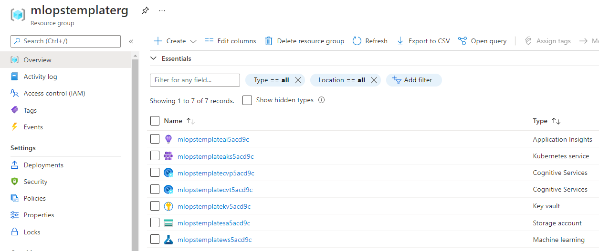
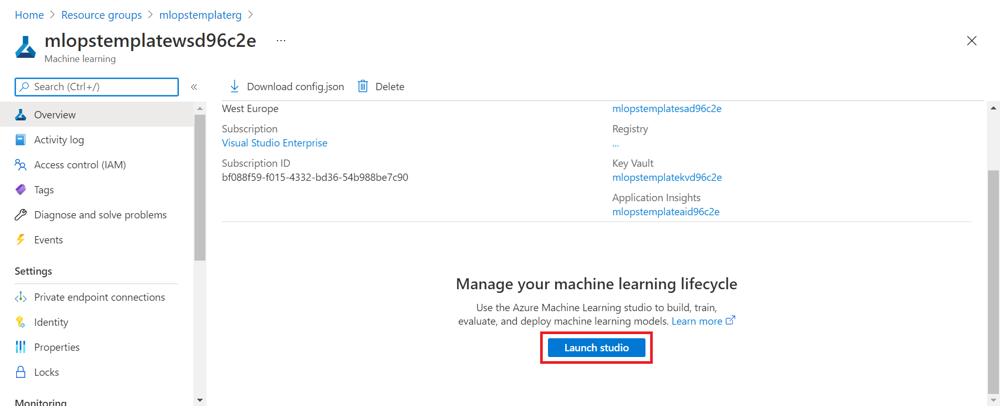
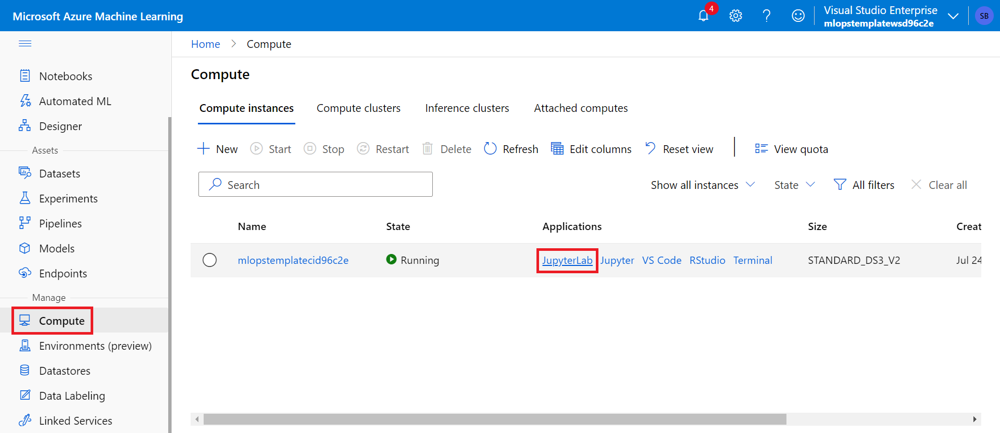
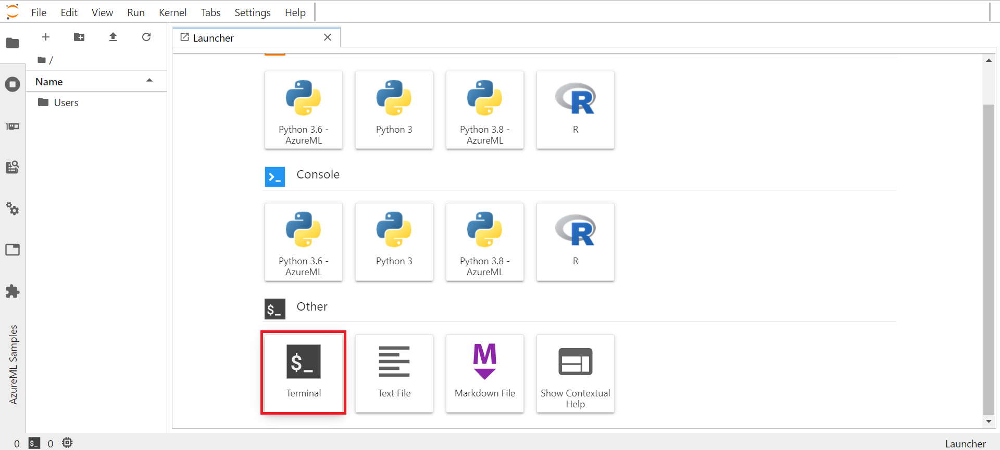
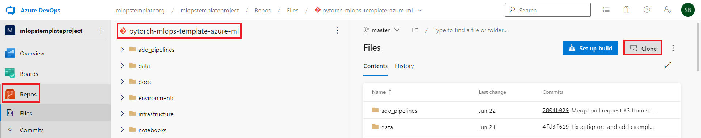
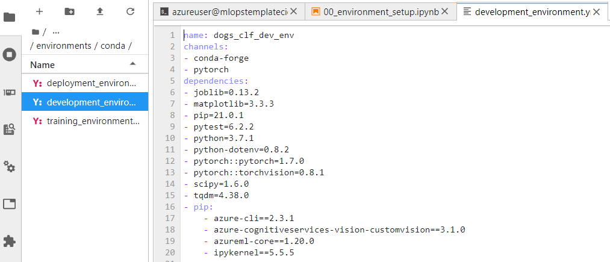
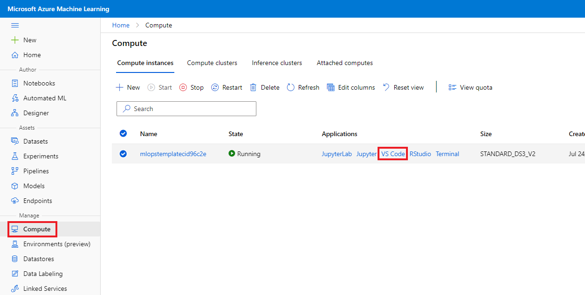

# PyTorch MLOps Template for Azure ML
 

## Summary
This repository contains an end-to-end implementation of an image classification model in Azure, leveraging Azure's MLOps capabilities. It is shown how to develop, train, deploy and serve models in the Azure ecosystem using different Azure services such as Azure Machine Learning, Azure DevOps, Azure Kubernetes Service, Azure App Service and more. The repository can be used as a template repository to quickly bootstrap similar modeling workloads from development to production.

Specifically, the following aspects are covered in this template repository:
-   Provisioning the Azure environment (Azure DevOps & Azure Infrastructure) with Terraform and following Infrastructure as Code (IaC) principles
-	Creating a conda development environment and adding it as a Jupyter kernel as well as creating Azure Machine Learning environments for model development, training and deployment
-	Downloading public data and uploading it to an Azure Blob Storage that is connected to the Azure Machine Learning workspace
-	Training a Custom Vision model with Azure Cognitive Services to have a benchmark model
-	Training a PyTorch model with transfer learning on Azure Machine Learning
-	Evaluating the trained models leveraging Azure Machine Learning capabilities
-	Deploying the trained model to different compute targets in Azure, such as Azure Machine Learning Compute Instance, Azure Container Instances, Azure Kubernetes Service
-	Creating a flask frontend for model serving and deploying it to Azure App Service
-	Creating Azure Machine Learning pipelines for trigger-based model training, evaluation, and registration
-	Building CI/CD pipelines in Azure DevOps for unit and integration testing, automated model training, automated model deployment, building and pushing images to an Azure Container Registry and automated deployment of the Flask frontend
-	Running CI/CD pipelines within a docker container on Azure Pipelines Agents

## Template Folder Structure
```
├── ado_pipelines                           <- ADO pipeline .yml files and other artifacts related to ADO pipelines
│   ├── templates                           <- Pipeline template modules that are used within other ADO pipelines
│   ├── variables                           <- Pipeline template files containing variables for ADO pipelines
│       ├── pipeline_variables.yml          <- Contains all pipeline variables for all pipelines
│   ├── ci_pipeline.yml                     <- Continuous integration pipeline with unit and integration tests
│   ├── docker_image_pipeline.yml           <- Pipeline to build and push Docker images to an Azure Container Registry
│   ├── flask_app_deployment_pipeline.yml   <- Continuous deployment pipeline for Flask web app
│   ├── model_deployment_pipeline.yml       <- Continuous deployment pipeline for model deployment to ACI/AKS
│   ├── model_training_pipeline.yml         <- Continuous integration pipeline for model training with an AML pipeline
├── data                                    <- Data (will be ignored by git except for example images for testing)
├── docs                                    <- All documentation
│   ├── how_to                              <- Markdown files that explain different aspects of the template
│   ├── images                              <- Images that are used in the Jupyter notebooks
├── environments                            <- Environment-related artifacts (for code execution)
│   ├── conda                               <- Conda .yml files for dev, train and deploy environments
│   ├── docker                              <- Dockerfiles
│       ├── inferencing_image               <- Dockerfile and inferencing artifacts to build the inferencing image
│       ├── mlops_pipeline_image            <- Dockerfile to build the mlops image for the Azure Pipelines Agent
├── infrastructure                          <- All terraform configuration files for infrastructure provisioning 
├── notebooks                               <- Jupyter notebooks end-to-end ML system development walkthrough
│   ├── notebook_utils                      <- All artifacts/utilities that are only required for the notebooks
│   ├── 00_environment_setup.ipynb          <- Conda env and jupyter kernel for dev; AML envs for dev, train, deploy 
│   ├── 01_dataset_setup.ipynb              <- Data download and upload to AML datastore; AML dataset registration
│   ├── 02_model_training.ipynb             <- Model training in AML; script and hyperdrive run; AML model registration
│   ├── 03_model_evaluation.ipynb           <- Evaluation of model on test set; addition of accuracy to AML model
│   ├── 04_model_deployment.ipynb           <- Model deployment to different compute targets using the AML Python SDK
│   ├── 05_model_training_pipeline.ipynb    <- Publishing of AML training pipeline with train, evaluate, register steps
│   ├── 10_custom_vision_model.ipynb        <- Model training in Custom Vision (Azure Cognitive Services) as benchmark
├── outputs                                 <- Output artifacts generated during ML lifecycle (e.g. model binaries)
├── src                                     <- Source code 
│   ├── config                              <- Configuration files (e.g. model training & evaluation parameter file)
│   ├── deployment                          <- Scripts needed for inference (e.g score.py script)
│   ├── flask_app                           <- All artifacts for the flask web frontend
│   ├── pipeline                            <- Scripts needed for automated model training with AML pipelines
│   ├── training                            <- Scripts needed for model training (e.g. train.py)
│   ├── utils                               <- Modularized utility functions that might be reused across the source code
├── testing                                 <- Testing-related artifacts
│   ├── integration                         <- Integration testing scripts
│   ├── unit                                <- Unit testing scripts (e.g. test PyTorch dataloader)
├── .amlignore                              <- Contains all artifacts not to be snapshotted by Azure Machine Learning
├── .env                                    <- Contains necessary environment variables which are used from source code
├── .gitignore                              <- Contains all artifacts that should not be checked into the git repo
├── README.md                               <- This README file (overview over the repository and documentation)
```

## Template Walkthrough
This section gives a detailed walkthrough of the template in a tutorial-like manner. It covers all the aspects mentioned in the [Summary](https://github.com/sebastianbirk/pytorch-mlops-template-azure-ml/blob/develop/README.md#summary) section above in chronological order and has the objective to enable the reader to set up the template and understand all aspects of it. 

### 1. Azure DevOps & Azure Resources Provisioning
Before we can dive into building the end-to-end ML solution, we need to set up our Azure environment. Our Azure environment will consist of an Azure DevOps project and the necessary Azure infrastructure. This template leverages the open-source infrastructure as code software tool Terraform to provision our Azure environment in an automated, robust and reproducible way using declarative configuration files written in the human-readable HashiCorp Configuration Language (HCL). All Terraform configuration files are stored in the `<TEMPLATE_ROOT>/infrastructure` directory. For more information on Terraform, check https://www.terraform.io/.

#### 1.1 Set up an Azure DevOps Organization & Personal Access Token (PAT)
First, we need to manually set up an Azure DevOps Organization and create a PAT that can be used by Terraform to interact with the Azure DevOps Service API. For this purpose, go to https://dev.azure.com and sign in to Azure DevOps with your account. Then click on "New organization" in the left side menu and create a new Azure DevOps organization with your desired name. We don't need to create an Azure DevOps Project as this will be taken care of by our Terraform configuration files.

Within your new Azure DevOps organization, create a Personal Access Token as follows:

   

Click on "Personal access token", then click on "New Token" and create a new Personal Access Token with "Full Access" called `terraform_pat`:

   

Make sure to store the created token, e.g. in a textfile. It will have to be stored inside an environment variable in the next step.

#### 1.2 Deliver Infrastructure as Code with Terraform
**Note**: Below setup steps and commands are based on the Bash Unix shell. Some commands will deviate if alternative command-line shells, such as PowerShell, are used instead.

Now that we have created our Azure DevOps Organization and Personal Access Token, we will provision the rest of our Azure environment using Terraform. Open a terminal on your local workstation and clone this template repository. Then, navigate to the  `infrastructure` directory of the template repository where all Terraform configuration files are stored (replace `<TEMPLATE_ROOT>` with the path to your cloned repository):
```console
$ git clone https://github.com/sebastianbirk/pytorch-mlops-template-azure-ml.git
$ cd <TEMPLATE_ROOT>/infrastructure
```

Next, set up the two below environment variables and replace `<ADO_ORG_NAME>` and `<ADO_PAT>` with the name of your Azure DevOps Organization and the PAT token that you have stored respectively.
```console
$ export TF_VAR_ado_org_service_url="https://dev.azure.com/<ADO_ORG_NAME>"
$ export TF_VAR_ado_personal_access_token="<ADO_PAT>"
```

If you have not yet installed the Azure CLI on your local workstation, install it as per the link given in the [Resources](https://github.com/sebastianbirk/pytorch-mlops-template-azure-ml/blob/develop/README.md#resources) section below. You can check whether you have the Azure CLI installed with the command:
```console
$ az --help
```

Once the Azure CLI is installed, log in to your Azure tenant, set the subscription and install the Azure Machine Learning CLI extension. Terraform uses the credentials stored by the Azure CLI to access the Azure Resource Manager API and the Azure DevOps Service API:
```console
$ az login --tenant <TENANT_ID>
$ az account set --subscription <SUBSCRIPTION_ID>
$ az extension add -n azure-cli-ml
```

If you have not yet installed the Terraform CLI on your local workstation, install it as per the link given in the [Resources](https://github.com/sebastianbirk/pytorch-mlops-template-azure-ml/blob/develop/README.md#resources) section below. You can check whether you have the Terraform CLI installed with the command:
```console
$ terraform -help
```

Once you have the Terraform CLI installed, we can start with the provisioning of the Azure environment.
Execute the Terraform initialization command to prepare the current working directory for use with Terraform:
```console
$ terraform init
```

Run the Terraform plan command to check whether the execution plan for a configuration matches your expectations before provisoning or changing infrastructure:
```console
$ terraform plan
```

Run the Terraform apply command to reach the desired state of the configuration (You will need to type "yes" to approve the execution):
```console
$ terraform apply
```

Your Azure environment should now be provisioned (you will have a different resource name suffix):

   

### 2. Model Development with the Azure Machine Learning Compute Instance (AML CI)
As part of the infrastructure provisioning, an AML CI has been provisioned for you. Go to the created Azure Machine Learning workspace and navigate to the "Compute" tab to access your AML CI. You can use JupyterLab, Jupyter or VSCode. Using the terminal in the IDE of your choice, clone the template repository that has been created in your Azure DevOps Project to your AML CI:
```console
$ https://<ADO_ORG_NAME></ADO_ORG_NAME>@dev.azure.com/mlopstemplateorg1/mlopstemplateproject/_git/pytorch-mlops-template-azure-ml
```

   
   
   
   
   
  


### Resources
Installing the Azure CLI:
https://docs.microsoft.com/en-us/cli/azure/install-azure-cli

Installing the Azure Machine Learning CLI:
https://docs.microsoft.com/en-us/azure/machine-learning/reference-azure-machine-learning-cli

Installing Terraform:
https://learn.hashicorp.com/tutorials/terraform/install-cli

Deploying Resources on Azure with Terraform:
https://fizzylogic.nl/2019/1/30/deploying-resources-on-azure-with-terraform

Provisioning an Azure Machine Learning Workspace using Terraform:
https://registry.terraform.io/providers/hashicorp/azurerm/latest/docs/resources/machine_learning_workspace

Attaching an AKS Cluster to the Azure Machine Learning Workspace:
https://docs.microsoft.com/en-us/azure/machine-learning/how-to-create-attach-kubernetes?tabs=azure-cli

Provisioning an Azure Machine Learning Enterprise Environment with Private Link Setup using Terraform:
https://github.com/csiebler/azure-machine-learning-terraform

Terraform Azure DevOps Provider:
https://registry.terraform.io/providers/microsoft/azuredevops/latest/docs
https://www.microsoft.com/de-de/techwiese/cloud-native-community-blog/einfuehrung-in-den-azure-devops-terraform-provider.aspx


